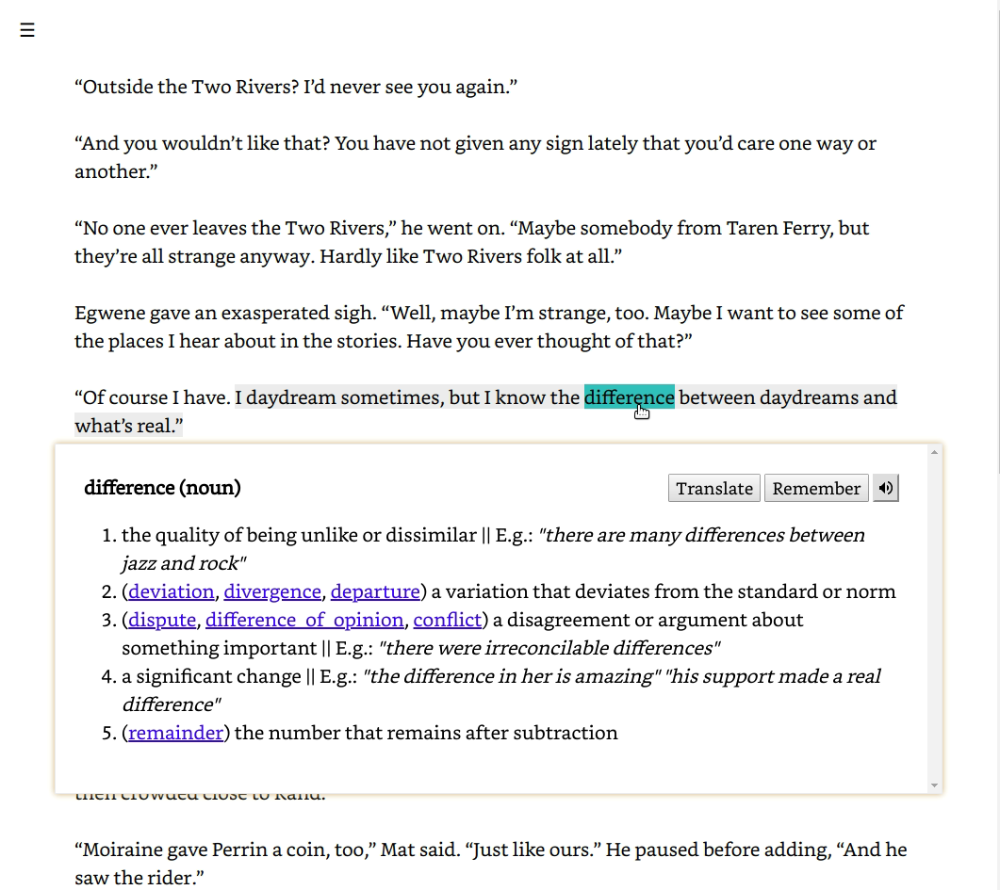

# Reader for English books

||
| ---- |

Works only with `.txt` files.

## Installation

1. Copy and fill hosts and vars for deploy
```
$ cd deploy
$ cp hosts.example.ini hosts.ini
$ cp group_vars/all.example.yml group_vars/all.yml
```

2. After server setup create htpasswd file(on server)

```
$ sudo sh -c "echo -n user:' >> /etc/nginx/.htpasswd"
$ sudo sh -c "openssl passwd -apr1 >> /etc/nginx/.htpasswd"
# will ask for password
```

3. Setup ssl certificate(needed for support offline feature), e.g. with letsencrypt(certbot). Like

```
$ sudo certbot --nginx
```
The nginx config waits for them in the folder `/etc/letsencrypt/live/{{ nginx__host }}/`
